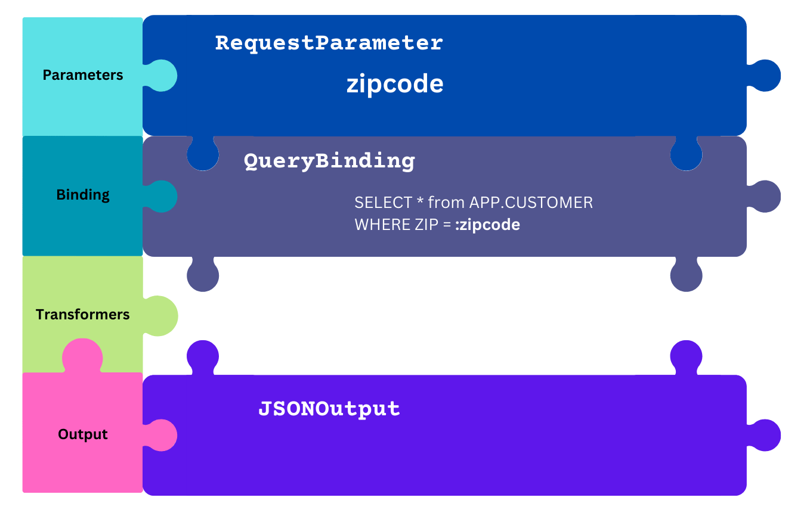

# Convirgance (Web Service): Wiring Components

Web Services is based around the `Service` interface. Services are similar to
Jakarta Servlets, processing web requests using `HttpRequest` and `HttpResponse`
objects. The key difference is they are designed to snap together common components
to create logic without coding in most circumstances.


<center><i>Visual representation of a simple <code>SelectService</code> that returns customers by zipcode</i></center>

Services are [Wiring](convirgance-wiring.md) files that snap together Web Service
components. Wiring files are looked up in the `webapp` path to call the service
at runtime.

For example, the file `src/main/webapp/api/CustomersByZipcode.xml` in the project
would be available at the URL path of `/api/CustomersByZipcode`.

## Common Concepts

This section goes over some of the common plugin concepts used across the
various service types.

### Parameters

Parameters represent individual inputs into the service. Named after the concept
of URL parameters in query strings (e.g. `?key=value`), they provide a way to
collect the expected values submitting. 

The simplest form is `RequestParameter` which obtains values from the 
`request.getParameter()` servlet API. Other common parameters include `PathVariable`
which obtains values from the URL path, `SessionParameter` which obtains
values from the Servlet session, and `HeaderParameters` to retrieve info from
HTTP headers.

Values from parameters are then consolidated into a map of key/value pairs to 
be bound to processing steps.

### Bindings / Consumers

Bindings are a step in the process that "bind" the key/value pairs collected by
parameters to queries or other processing. Most commonly is the `QueryBinding`
which allows named SQL parameters using the `:name` format.

Consumers are similar to bindings with the primary difference being the source
of the key/value pairs. Rather than binding parameters, consumers bind a record.
This is most commonly used during insert operations where a stream of records
is submitted that need to be batch inserted into a database.

Both bindings and consumers return a stream of output records.

### Output

Web Services uses the same `Output` components provided by Core library. The most
common response format is `JSONOuput`, but numerous other formats (e.g. CSV) can
be plugged in.


### Transformers

Transformers from the Core library can be used to manipulating streams of records
returning from a binding or before handling by a consumer. This allows you to
enrich data, delete data, and reformat data.

### Validators

Validators are special transfoerms that stop the processing of data if a data
validation fails. Commonly used as a final validation in case submission made
it past client-side validation.


## Services

There are several `Service` implementations that can provide a useful base for
composing logic. Most applications will start with a `SelectService` to provide
data to the user interface and then add an `InsertService` to save data. 

More complex applications can use `RoutedService`, `RESTService`, and 
`HypermediaService` to create rich applications that utilize REST approaches
to application design.

### SelectService

The workhorse of the service implementations, `SelectService` provides an easy
method of developing data retrieval services. It functions by collecting key/value
pairs from a set of pluggable parameters, then passing those key/value pairs to
a binding for processing.

The binding then returns a stream of data that can be transformed before being
serialized to the desired format. While most oftent that format will be JSON, it
can just as easily be CSV, pipe-delimited, YAML, and many other formats. 

**Pipeline:**

| Plugin            | Required | Description                                                                       |
|-------------------|----------|-----------------------------------------------------------------------------------|
| parameters        | No       | Collects key/value parameters for use in the binding                              |
| binding           | Yes      | Produces a stream of `JSONObject` records based on the parameters                 |
| transformers      | No       | Manipulates the data returned by the binding before being passed to the output    |
| output            | Yes      | Serializes the data into the desired format. Most services will use `JSONOutput`. |


**Example:**

```xml
<?xml version="1.0" encoding="UTF-8"?>
<SelectService>
    <parameters>
        <list>
            <RequestParameter>
                <name>zipcode</name>
            </RequestParameter>
        <list>
    </parameters>
    <binding>
        <QueryBinding>
            <sql>
            <![CDATA[
SELECT * from APP.CUSTOMER
WHERE ZIP = :zipcode
]]>
            </sql>
        </QueryBinding>
    </binding>
    <output>
        <JSONOutput />
    </output>
</SelectService>
```

### InsertService


**Pipeline:**

| Plugin            | Required | Description                                                                       |
|-------------------|----------|-----------------------------------------------------------------------------------|
| parameters        | Yes      | Collects key/value parameters for use in the binding                              |
| input             | Yes      |                  |
| origin            | Yes      |                  |
| injectParameters  | Yes      |                  |
| transformers      | No       | Manipulates the stream data before being passed to the consumer    |
| consumer          | Yes      |                  |
| output            | No       | Serializes the data into the desired format. If not specified, default is `JSONOutput` |


**Example:**

```xml
<?xml version="1.0" encoding="UTF-8"?>
<InsertService>
</InsertService>
```

### RESTService

Used to route requests to a different `Service` implementations based upon the
HTTP method. Any method without a `Service` to handle it will return a `404 Not Found`
error.

**Pipeline:**

| Plugin     | Required | Description                                            |
|------------|----------|--------------------------------------------------------|
| GET        | No       | Specify service to handle GET requests                 |
| POST       | No       | Specify service to handle POST requests                |
| PUT        | No       | Specify service to handle PUT requests                 |
| DELETE     | No       | Specify service to handle DELETE requests              |


**Example:**

```xml
<?xml version="1.0" encoding="UTF-8"?>
<RESTService>
    <GET>
        <SelectService>
        ...
        </SelectService>
    </GET>
    <POST>
        <InsertService>
        ...
        </InsertService>
    </POST>
</RESTService>
```

### RoutedService

Calls other services based upon the path of the request. Longer paths have
priority over shorter paths, allowing for complex heirarchies of services to be
created. 

The `*` can be used as a wildcard in the path for places where the value in the
URL is not known ahead of time. 

**Pipeline:**

| Plugin     | Required | Description                                            |
|------------|----------|--------------------------------------------------------|
| routes     | Yes      | A map of url paths to services                         |

**Example:**

```xml
<?xml version="1.0" encoding="UTF-8"?>
<RoutedService>
    <routes>
        <list>
            <entry>
                <string>/api/owner</string>
                <SelectService>
                ...
                </SelectService>
            </entry>
            <entry>
                <string>/api/owner/*/pet</string>
                <SelectService>
                ...
                </SelectService>
            </entry>
        </list>
    </routes>
</RoutedService>
```

### HypermediaService

Allows JSP pages or other template components to be organized into a Hypermedia
Driven Application (HDA) based on REST principles. 

Making a `GET` request on the service will render the requested JSP (or other template
language) path. The collected parameters will be available to the JSP as regular
`${param.name}` values. 

`HypermediaVerb` instances can be registered to handle verbs like `edit` and
`create`. These verbs will cause alternate pages to be rendered on a `GET`
request, and provide a backend service to handle a `POST` request. This allows
Hypermedia to be accomplished within the bounds of standard form controls.

**Note:** Forms submitted to the `HypermediaService` will be transformed into a
`JSONObject` stream in the request body before being forwarded to the backend 
service. This makes the form submission transparent to the backing service.

**Pipeline:**

| Plugin     | Required | Description                                            |
|------------|----------|--------------------------------------------------------|
| parameters | No       | A list of Parameters to use in processing the request  |
| page       | Yes      | Default page to render for GET requests                |
| verbs      | Yes      | List of `HypermediaVerb` handlers for edits, deletes, creates, etc. |


**HypermediaVerb:**

| Plugin     | Required | Description                                            |
|------------|----------|--------------------------------------------------------|
| name       | Yes      | The name of the verb to take action on. Is expected to be added to the end of the service URL.  |
| page       | No       | JSP page or Servlet to render if a GET request is received |
| service    | No       | URL of service to call on POST                         |
| method     | No       | Override the method when calling the service on POST (e.g. PUT, DELETE, etc.) |
| redirect   | No       | After calling the service on POST, redirect to this URL. Redirects to the non-verb URL if not set. |


**Example:**

```xml
<?xml version="1.0" encoding="UTF-8"?>
<HypermediaService>
    <parameters>
        <list>
            <PathVariable>
                <path>/views/owner/{id}</path>
            </PathVariable>
        </list>
    </parameters>
    <page>/WEB-INF/components/owner/view.jsp</page>
    <verbs>
        <list>
            <verb>
                <name>create</name>
                <page>/WEB-INF/components/owner/create_edit.jsp</page>
                <service>/services/owner/{id}</service>
                <method>POST</method>
                <redirect>/views/owner/{id}</redirect>
            </verb>
            <verb>
                <name>edit</name>
                <page>/WEB-INF/components/owner/create_edit.jsp</page>
                <service>/services/owner/{id}</service>
                <method>PUT</method>
            </verb>
        </list>
    </verbs>
</HypermediaService>
```