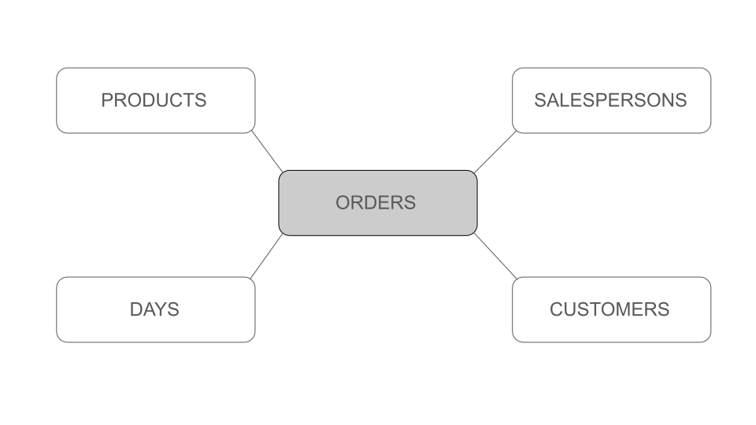

<style>body {text-align: left}</style>

# Online Analytical Processing (OLAP)

As businesses grow and expand, they gain useful analytical data about 
their own customers and the market itself. OLAP (Online Analytical Processing) 
provides a means of sythesizing this data into useful metrics to provide business intelligence insights.

Convirgance (OLAP), built on top of Convirgance package, provides an easy and intuitive
way to build OLAP tools such as queries against Star Schemas to perform such 
interactive multidimensional data analysis and aid businesses in their operations.

A star schema is a type of multidimensional database design commonly used in data warehousing, 
where a central fact table (containing quantitative data) is connected to multiple
dimension tables (describing the context of the data) and other metric tables that also describe 
quantitative data. This structure simplifies analytical queries and accelerates 
information retrieval from databases.


With some additional web configuration, this package gives you an opportunity
to quickly build in-house analytical systems to support your
business either visualizing measures (ex. average sales) across different dimensions without the need for expensive outsourcing.

Read on to better understand how Convirgance (OLAP) offers such functionality.

## Installation

Add the following dependency to your Maven `pom.xml` file:

```xml
<dependency>
    <groupId>com.invirgance</groupId>
    <artifactId>convirgance-olap</artifactId>
    <version>0.1.0</version>
</dependency>
```


## Representing Database Structure

Suppose you are working on an online retail analytics and you have the following
star schema model with ORDERS as the central fact table, and PRODUCTS, 
SALESPERSONS, CUSTOMERS, and DAYS as dimensions:

 


Convirgance (OLAP) uses the
following classes to first capture the core database structure of the schema
we want to model:

| Class          | Function                                                                                          |
| -------------- | ------------------------------------------------------------------------------------------------- |
| `Database`     | Database structure representation; contains table objects.                   |
| `ForeignKey`   | Captures the connection between a source table, a column on the source table, and a target table. |
| `SQLGenerator` | Support for creating and outputting SQL queries for working with OLAP.                   |
| `Table`        | For Table object representation. Contains a primary key and list of foreign keys, which are columns shared between a source and target table.      |

- [detailed documentation for the classes above](https://docs.invirgance.com/javadocs/convirgance-olap/latest/com/invirgance/convirgance/olap/sql/package-summary.html)


Here is how to capture the database structure from the above star schema:

```java

Database stardb = new Database("StarDB");

Table orders = new Table("ORDERS", "order_id");
Table products = new Table("PRODUCTS", "product_id");
Table salespersons = new Table("SALESPERSONS", "salesperson_id");
Table customers = new Table("CUSTOMERS", "customer_id");
Table days = new Table("DAYS", "day_id");

stardb.addTable(orders);
stardb.addTable(products);
stardb.addTable(salespersons);
stardb.addTable(customers);
stardb.addTable(days);

orders.addForeignKey("product_id", products);
orders.addForeignKey("salesperson_id", salespersons);
orders.addForeignKey("customer_id", customers);
orders.addForeignKey("day_id", days);

```

Note that at this stage of representing tables, we simply capture a table's structure with the name and 
primary key as parameters. We can later add foreign keys as needed, as we do 
with our central fact table `ORDERS`. 


The specific columns necessary for SQL queries are specified later within the SQLGenerator.

___________

<!-- This tool is for generating SQl out of olap structure. needs to understand the
structure of teh data
table just represents that a table exists. 
an object in star schema. 
on top of that we put dimensions/metrics

todo: 1. just stay we create a structure for the star schema
2. once we have the structure, we can specify the dimensions and metrics
3. create a super simple star schema
    star diagram (e.g. 4 dimensions, 1 central table)

explain with the example the schema, dimensions, facts (metrics)

fact table at the centre is the table containing all the facts/metrics 

only have a few record (4-10)-->


With the relationship defined by the Table, ForeignKey, and Database classes,
the SQLGenerator can now output OLAP queries for us. Here is how it works:

1.  The `addSelect(String column, Table table)` lets us define a select from a table
2.  We capture this select in a `Column` inner class that represents the column and table
3.  We add the table to a list of tables we need to create joins between
4.  The addTable(Table table) method is public because OLAP queries are centered around a Fact table. The Fact table must be added first as the “From” table so that all joins fan out from it. Even if we never select any data from the Fact table itself.
5.  The getSQL() method loops through the select list to generate the columns to select and generates the first table in the list as the “from” table. It then calls generateJoins(from) and generateGroupBy().
<!-- TODO nit: 4 and 5 are a little on the long side -->
6.  generateJoins(from) matches the ForeignKeys in the “from” table to tables in our list of selects and generates a join for each one
7.  generateGroupBy() loops through the selected columns again and generates a group by list of all columns that are not aggregates. i.e. They are dimension columns.

    - Wait… what are aggregates?

8.  Aggregates are the “fact” or “metric” columns that we want to roll up using a function like “sum()” or “avg()”
<!-- TODO nit 4, 5, 6, 8: use backticks when referring to the From table also with functions/objects table -->
9.  We can call `addAggregate(String function, String column, Table table)` to add the aggregate to our select list
10. We use an inner class called Aggregate to capture this select. Aggregate uses the inheritance pattern in OOP to “be” a Column while additionally capturing the function and overriding the getSQL() method.

    - Because our Aggregate “is” a Column, we don’t need to change any of our select logic or manage it separately.

    <!-- TODO nit: use single quotes when referring to something abstract ex nuclear fission reactors 'existed' 2 billion years ago but only because of the earths enviroment and very specific conditions. -->


## Generating SQL Queries

Now that we have our database representation and tooling, we can generate
SQL queries in the following way:

This java code...

```java

generator.addTable(orders);
generator.addSelect("product_name", products);
generator.addSelect("saesperson_name", salespersons);

generator.addAggregate("sum", "Quantity", sales, "Products Sold");

generator.getSQL(); // Get the SQL!
```

...generates the following SQL query:

```SQL
select
    DimFranchise.FranchiseName,
    DimStore.StoreName,
    sum(FactSales.Quantity)
from FactSales
join DimFranchise on DimFranchise.id = FactSales.FranchiseId
join DimStore on DimStore.id = FactSales.StoreId
group by
    DimFranchise.FranchiseName,
    DimStore.StoreName
```


<!--

This java code...

```java
SQLGenerator generator = new SQLGenerator();
Database stardb = new Database("StarDB");
Table sales = new Table("FactSales", "id");
Table franchise = new Table("DimFranchise", "id");
Table store = new Table("DimStore", "id");

stardb.addTable(sales);
stardb.addTable(franchise);

sales.addForeignKey("FranchiseId", franchise);
sales.addForeignKey("StoreId", store);

generator.addTable(sales);
generator.addSelect("FranchiseName", franchise);
generator.addSelect("StoreName", store);
generator.addAggregate("sum", "Quantity", sales, "Products Sold");

generator.getSQL(); // Get the SQL!
```

...generates the following SQL query:

```SQL
select
    DimFranchise.FranchiseName,
    DimStore.StoreName,
    sum(FactSales.Quantity)
from FactSales
join DimFranchise on DimFranchise.id = FactSales.FranchiseId
join DimStore on DimStore.id = FactSales.StoreId
group by
    DimFranchise.FranchiseName,
    DimStore.StoreName
```
-->
## Spring Method

The above example still requires a lot of code to produce a single query.
We should have a config file. Thanks to the inherent properties of Java Objects, we can just pull a Spring configuration file off the shelf!
We simply load the Spring context, request the database, and pull whichever tables we need by calling `database.getTable(String name)`.

<!-- TODO maybe add an example for this 

use the example above, create the spring config file based off that.

-->

## OLAP Interface

To bridge the database representation with an OLAP interface, we need additional layer of tooling
to represent Dimensions, Metrics (aka Facts), and Measures (just aggregated Metrics). These act as building blocks to comprise
the Star Schema, from which we then generate reports.

| Class             | Function                                                                     |
| ----------------- | ---------------------------------------------------------------------------- |
| `Dimension`       | Provides support for qualitative/contextual descriptions of data.            |
| `Measure`         | Provides support for aggregated quantitative values of data.                 |
| `Metric`          | Provides support for quantitative values of data.                            |
| `ReportGenerator` | Provides support for the SQL query generation from constructed star schemas. |
| `Star`            | Provides support for the central star schema.                                |

- [detailed documentation for the classes above](https://docs.invirgance.com/javadocs/convirgance-olap/latest/com/invirgance/convirgance/olap/package-summary.html)

1. The `Star` plays the role of a central container, and it tracks the fact table at the center.
   Around the fact table are Dimensions. Inside the fact table are Metrics.
   Metrics will be aggregated in queries, so these are represented by Measures.

2. `Dimension` and `Metric` are simple, they simply contain a column
   name and a Table reference.

3. `Measure` also contains a column name, but no table. Instead, it wraps the
   associated with it Metric along with a function. The function is just the name of the
   SQL function we want to apple, such as "avg" or "sum".

4. Finally, the `ReportGenerator` allows to create queries within OLAP context.
   As an OLAP user, you no longer need to think about the underlying query structure. Instead,
   you simply specify Dimensions and Measures, and the OLAP layer takes care of the rest by pushing
   the the parameters down to the SQLGenerator.

  <!-- TODO nit: order list as items appear in the table or reoder the table -->

Here too, you can add the Star schema to the Spring configuration file just like we did with the Database above.
You can then lookup the Star from the configuration file and query immediately:

Here's how we can generate the same SQL Query as above by using the Star configured in Spring:

<!-- fill in the story with code actually constructing a star.
There is a test case that constructs a star that you can use. -->

```java
Star star = getStar(); // Load the Star from the Spring file
ReportGenerator generator = new ReportGenerator(star);

generator.addDimension(star.getDimension("Franchise Name"));
generator.addDimension(star.getDimension("Store Name"));
generator.addMeasure(star.getMeasure("Units Sold"));

generator.getSQL(); // Generate the SQL!
```

<!--As a next step, you can use [Convirgance-WEB](https://github.com/InvirganceOpenSource/convirgance-web) to create web services around this OLAP
structure. -->

##### [Previous: File Formats](./file-formats)

##### [Support and Contacts](./contact)

##### [Back to start?](./?id=convirgance)

<!-- TODO links to docs just copy-paste the format from another readme -->
